## Introduction: Understanding Linux Permissions  

Before diving into practical user and group management, it's crucial to understand how Linux permissions work—because secure collaboration starts with correct access control.

When you run `ls -l` on a file or directory, you'll see output like `drwxrwxr--`. Let's break down what this means:

### **Permission Classes**  
- **u** (User): The owner of the file  
- **g** (Group): The group associated with the file  
- **o** (Other): All other users on the system

### **Permission Types**  
- **r** (Read): View the contents of a file or list directory contents  
- **w** (Write): Modify a file or create/delete/rename files in a directory  
- **x** (Execute): Run a file as a program/script or enter a directory

### **Numerical (Octal) Notation**  
Permissions are often represented using numbers:

| Permission | Value |
|------------|-------|
| Read (r)   |   4   |
| Write (w)  |   2   |
| Execute (x)|   1   |

Combine these for each class:
- `rw-` = 4 (Read) + 2 (Write) = **6**
- `r-x` = 4 (Read) + 1 (Execute) = **5**
- `---` = 0 (None) = **0**

Full permission sets use three digits: **User | Group | Other**
- Example: `chmod 760 file.txt`  
  - **7** (rwx) for User  
  - **6** (rw-) for Group  
  - **0** (---) for Other

Mastering these basics is essential for setting up secure, collaborative environments in Linux.

## Table of Contents
1. [Lab Overview](#lab-overview)
2. [Objectives](#objectives)
3. [Prerequisites](#prerequisites)
4. [Step 1: Creating Users and Groups](#step-1-creating-users-and-groups)
5. [Step 2: Creating the Shared Directory](#step-2-creating-the-shared-directory)
6. [Step 3: Testing the Configuration](#step-3-testing-the-configuration)
7. [Step 4: Implementing SGID](#step-4-implementing-sgid)
8. [Step 5: Verifying the Solution](#step-5-verifying-the-solution)
9. [Step 6: User Lifecycle Management](#step-6-user-lifecycle-management)
10. [Special Permissions: SetUID, SetGID, Sticky Bit](#special-permissions-setuid-setgid-and-sticky-bit)
11. [Troubleshooting](#troubleshooting)
12. [FAQ](#faq)
13. [Further Reading](#further-reading)
14. [Clean-Up](#clean-up)
15. [Credits](#credits)

---

## Lab Overview

This lab walks through the complete lifecycle of managing Linux users and permissions for collaborative projects. You'll learn how to create users, assign them to groups, configure shared directories with correct permissions, implement secure collaboration using the SGID bit, and safely remove users while handling their files. Mastering these tasks is essential for system administrators, DevOps engineers, and anyone responsible for Linux security.

---

## Objectives

By the end of this lab, you will be able to:

- Create and manage user accounts and groups.
- Set up a secure shared directory for collaboration.
- Diagnose and solve permission problems with standard Linux permissions.
- Implement the SGID bit for group-based access control.
- Safely remove users and handle their files.
- Apply best practices for Linux system security and user lifecycle management.

---

## Prerequisites

- Access to a Linux system (VM, cloud instance, or local install).
- Sudo privileges.
- Basic familiarity with the Linux command line.
- Terminal emulator.
- Tool for taking screenshots (e.g., GNOME Screenshot, Flameshot, or `gnome-screenshot` via CLI).

---

## Step 1: Creating Users and Groups

First, create user accounts and a group to manage them. This establishes the identities our permissions will later control.

```bash
sudo useradd -m -s /bin/bash alice
sudo useradd -m -s /bin/bash bob
sudo groupadd webdev
sudo usermod -aG webdev alice
sudo usermod -aG webdev bob
```

**Command & Flag Explanation:**

- `sudo`: Run as superuser for admin operations. Needed for system changes.
- `useradd`: Add a new user.
  - `-m` (`--create-home`): Create a home directory for the user if it doesn't exist.
  - `-s /bin/bash` (`--shell`): Set the user's login shell to `/bin/bash`.
- `groupadd`: Create a new group.
- `usermod`: Modify an existing user.
  - `-aG`:
    - `-a` (`--append`): Add the user to supplementary groups without removing them from other groups.
    - `-G` (`--groups`): Specify the group(s) to add the user to.

**Setting User Passwords:**

```bash
sudo passwd alice
sudo passwd bob
```

- `passwd [username]`: Set or change a user's password. Prompts interactively and securely.

**Verifying Creation :**

```bash
getent passwd alice bob
getent group webdev
groups alice
```

- `getent`: Display entries from system databases.
  - `passwd`: Shows user information.
  - `group`: Shows group information.
- `groups [username]`: List all groups a user is a member of.

> 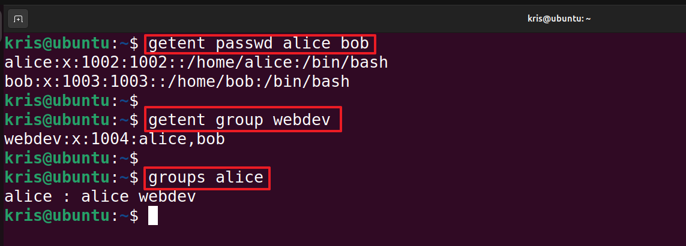  
> _"Output confirming successful user and group creation, with both users added to the 'webdev' group."_

---

## Step 2: Creating the Shared Directory

Create a directory for the project and assign group ownership.

```bash
sudo mkdir /opt/project_alpha
sudo chgrp webdev /opt/project_alpha
sudo chmod 770 /opt/project_alpha
```

**Command & Flag Explanation:**

- `mkdir /opt/project_alpha`: Create a new directory at `/opt/project_alpha`.
- `chgrp webdev /opt/project_alpha`:
  - `chgrp`: Change the group ownership of a file or directory.
  - `webdev`: The group to assign as the owner.
- `chmod 770 /opt/project_alpha`:
  - `chmod`: Change file or directory permissions.
  - `770`: Octal notation; full permissions for user and group (rwx/rwx/---), none for others.

**Verification :**

```bash
ls -ld /opt/project_alpha
```

- `ls`: List directory contents.
- `-l`: Long listing format, showing permissions, owner, group, etc.
- `-d`: Show information about the directory itself, not its contents.

> 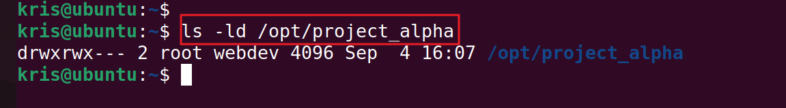  
> _"Directory listing for /opt/project_alpha shows correct group ownership and permissions (770), restricting access to non-team members."_

If you want to clean up, remove the directory:

```bash
sudo rm -rf /opt/project_alpha
```

---

## Step 3: Testing the Configuration

Switch users securely and test file creation.

```bash
su - alice
cd /opt/project_alpha
touch file_by_alice.txt
ls -la
exit
```

**Command & Flag Explanation:**

- `su - alice`:
  - `su`: Switch user.
  - `-`: Start a login shell, loading user's environment and home directory.
  - `alice`: Target user.
- `cd /opt/project_alpha`: Change to the shared directory.
- `touch file_by_alice.txt`: Create a new empty file.
- `ls -la`:
  - `ls`: List directory contents.
  - `-l`: Long format.
  - `-a`: Include hidden files.
- `exit`: Exit the shell, returning to the previous user.

**Key Output :**

After running `ls -la`, take a screenshot of the permissions and ownership info.

> 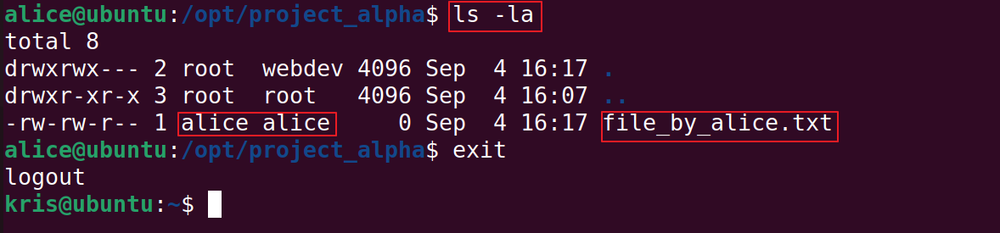  
> _"File created by 'alice' inherits her primary group instead of 'webdev', illustrating collaboration permission issues."_

Delete the test :

```bash
sudo rm /opt/project_alpha/file_by_alice.txt
```

---

## Step 4: Implementing SGID

Set the SGID bit to ensure new files inherit the group's ownership.

```bash
sudo chmod 2770 /opt/project_alpha
ls -ld /opt/project_alpha
```

**Command & Flag Explanation:**

- `chmod 2770 /opt/project_alpha`:
  - `chmod`: Change permissions.
  - `2` (first digit): Set the SGID (Set Group ID) bit, so new files/directories created inside will inherit the directory's group.
  - `770` (remaining digits): Owner and group have full permissions (`rwx`), others have none.
  - So, `2770` means SGID enabled + user/group full access.
- `ls -ld /opt/project_alpha`:
  - `ls`: List directory contents.
  - `-l`: Long format.
  - `-d`: Show info about the directory itself.

> 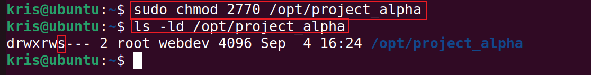  
> _"Directory permissions now show the SGID bit (s), ensuring group ownership for new files in /opt/project_alpha."_

---

## Step 5: Verifying the Solution

Repeat file creation as a group member.

```bash
su - alice
cd /opt/project_alpha
touch new_file_after_sgid.txt
ls -la
exit
```

**Command & Flag Explanation:**
- Same commands as Step 3, now with SGID enabled.
- The key difference: new files inherit the directory’s group (`webdev`) instead of the user’s primary group.

> 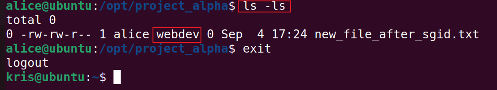  
> _"New file created after SGID fix inherits 'webdev' group, enabling full collaborative access."_

Delete the test file:

```bash
sudo rm /opt/project_alpha/new_file_after_sgid.txt
```

---

## Step 6: User Lifecycle Management

### Find all files owned by a user before deletion:

```bash
sudo find / -user bob -ls 2>/dev/null
```

**Command & Flag Explanation:**
- `find /`: Start searching from the root directory.
- `-user bob`: Find files owned by user `bob`.
- `-ls`: List detailed info for each result (similar to `ls -l`).
- `2>/dev/null`: Suppress error messages (like "Permission denied") for cleaner output.


  
> 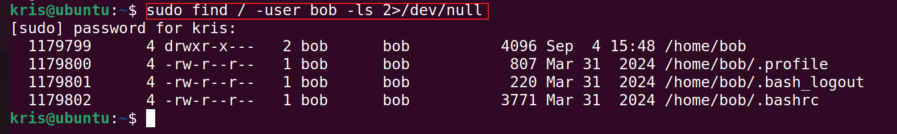  
> _"Listing all files owned by 'bob' prior to account removal, ensuring thorough auditing before deletion."_

### Remove the user (keep files):

```bash
sudo userdel bob
getent passwd bob
```

**Command & Flag Explanation:**
- `userdel bob`: Delete the user account (does not remove files).
- `getent passwd bob`: Confirm user removal.

### Remove the user and their files:

```bash
sudo userdel -r bob
getent passwd bob
ls -ld /home/bob 2>/dev/null || echo "Home directory /home/bob has been removed."
```

**Command & Flag Explanation:**
- `userdel -r bob`: Delete user account and their home directory/mail spool.
- `-r` (`--remove`): Remove files associated with the user.
- `ls -ld /home/bob 2>/dev/null`: Check if home directory is still present.
- `|| echo ...`: Print message if directory has been deleted.


  
> 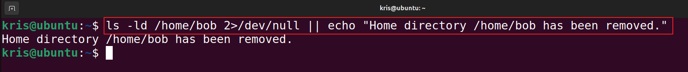  
> _"Verification that 'bob' has been removed from system accounts and his home directory is gone."_

### Force removal (use with caution):

```bash
sudo userdel -f bob
sudo userdel -f -r bob
```

**Command & Flag Explanation:**
- `-f` (`--force`): Force removal of the user, even if they are logged in or have running processes/files.

### Reassign orphaned files (optional):

```bash
sudo chgrp -R webdev /opt/project_alpha
sudo chown -R alice /opt/project_alpha
```

**Command & Flag Explanation:**
- `chgrp -R webdev /opt/project_alpha`:
  - `chgrp`: Change group ownership.
  - `-R` (`--recursive`): Apply change to all files/subdirectories.
- `chown -R alice /opt/project_alpha`:
  - `chown`: Change user ownership.
  - `-R` (`--recursive`): Apply change to all files/subdirectories.


> 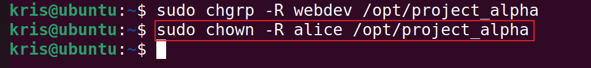  
> _"Changing ownership of orphaned files in the shared directory to maintain team access after user deletion."_

---

## Special Permissions: SetUID, SetGID, and Sticky Bit

Linux supports three special permission bits that extend standard file and directory permissions. Here’s how to set, verify, and **document with screenshots** each one.

---

### SetUID Lab

SetUID lets executables run as the file owner (often root).  
**Note:** SetUID is only effective on binaries—not scripts.

#### Commands to Run

```bash
# Copy 'ls' binary to /tmp for testing
sudo cp /bin/ls /tmp/ls-setuid

# Set ownership to root
sudo chown root:root /tmp/ls-setuid

# Set SetUID using octal and symbolic methods
sudo chmod 4755 /tmp/ls-setuid
# OR
sudo chmod u+s /tmp/ls-setuid

# List permissions to verify
ls -l /tmp/ls-setuid
```

#### Expected Output

```
-rwsr-xr-x 1 root root ... /tmp/ls-setuid
```


> 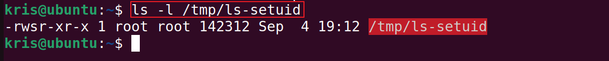
> _"Screenshot showing the permissions of /tmp/ls-setuid, highlighting the setuid bit (s) in the user permissions."_
#### Command Explanations

- `sudo cp /bin/ls /tmp/ls-setuid`: Make a test copy of `ls` in `/tmp`.
- `sudo chown root:root ...`: Ensure the owner is root.
- `sudo chmod 4755 ...`: Set permissions rwxr-xr-x **and** SetUID (octal).
- `sudo chmod u+s ...`: SetUID (symbolic).
- `ls -l ...`: The `s` in the user field (`rws`) confirms SetUID.

---

### SetGID on File Lab

SetGID on a binary causes it to run with the file's group privileges.

#### Commands to Run

```bash
# Copy 'ls' binary to /tmp for testing
sudo cp /bin/ls /tmp/ls-setgid

# Set group to webdev (or your test group)
sudo chown root:webdev /tmp/ls-setgid

# Set SetGID using octal and symbolic methods
sudo chmod 2755 /tmp/ls-setgid
# OR
sudo chmod g+s /tmp/ls-setgid

# List permissions to verify
ls -l /tmp/ls-setgid
```

#### Expected Output

```
-rwxr-sr-x 1 root webdev ... /tmp/ls-setgid
```

> 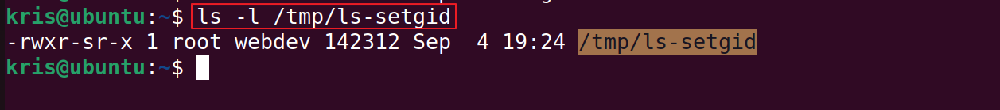
> _"Screenshot showing the permissions of /tmp/ls-setgid, with the setgid bit (s) clearly visible in the group permissions field."_

#### Command Explanations

- `sudo cp /bin/ls /tmp/ls-setgid`: Test copy for demo.
- `sudo chown root:webdev ...`: Change group to webdev.
- `sudo chmod 2755 ...`: Set permissions rwxr-xr-x **and** SetGID (octal).
- `sudo chmod g+s ...`: SetGID (symbolic).
- `ls -l ...`: The `s` in the group field (`r-s`) confirms SetGID.

---

### SetGID on Directory Lab

SetGID on directories ensures new files inherit the directory's group.

#### Commands to Run

```bash
# Create test directory
sudo mkdir /tmp/shared-gid

# Set group to webdev (or your test group)
sudo chown root:webdev /tmp/shared-gid

# Set SGID using octal and symbolic methods
sudo chmod 2770 /tmp/shared-gid
# OR
sudo chmod g+rwx,g+s /tmp/shared-gid

# List directory permissions to verify
ls -ld /tmp/shared-gid
```

#### Expected Output

```
drwxrws--- 2 root webdev ... /tmp/shared-gid
```

> 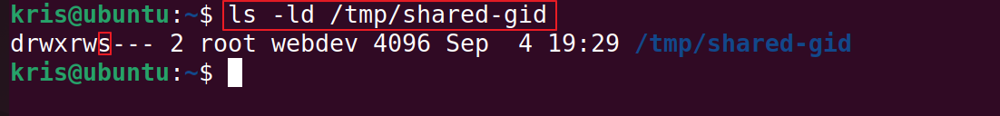
> _"Screenshot displaying the permissions of /tmp/shared-gid, with the setgid bit (s) clearly indicated in the group section of the directory listing."_

#### Command Explanations

- `sudo mkdir ...`: Make a test directory.
- `sudo chown root:webdev ...`: Set group.
- `sudo chmod 2770 ...`: SGID + rwxrwx--- (octal).
- `sudo chmod g+rwx,g+s ...`: Symbolic method.
- `ls -ld ...`: The `s` in group permissions (`rws`) confirms SGID.

---

### Sticky Bit on Directory Lab

Sticky Bit secures shared directories so only owners/root can delete their own files.

#### Commands to Run

```bash
# Create a shared directory
sudo mkdir /tmp/sticky-test

# Set sticky bit using octal and symbolic methods
sudo chmod 1777 /tmp/sticky-test
# OR
sudo chmod a+rwx,+t /tmp/sticky-test

# List directory permissions to verify
ls -ld /tmp/sticky-test
```

#### Expected Output

```
drwxrwxrwt 2 root root ... /tmp/sticky-test
```

> 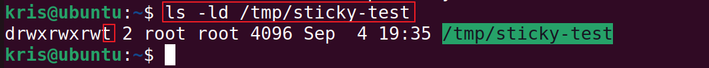
> _"Screenshot displaying the permissions of /tmp/sticky-test, with the sticky bit (t) clearly indicated in the directory’s permission field."_

#### Command Explanations

- `sudo mkdir ...`: Create test directory.
- `sudo chmod 1777 ...`: Sticky bit + rwxrwxrwx (octal).
- `sudo chmod a+rwx,+t ...`: Symbolic method.
- `ls -ld ...`: The `t` at the end (`rwt`) confirms the sticky bit.

---

### Sticky Bit Effect Lab

Demonstrate sticky bit protection by showing a failed delete attempt.

#### Commands to Run

```bash
# As alice, create a file in the sticky directory
su - alice
touch /tmp/sticky-test/alice.txt
exit

# As bob, try to delete alice's file
su - bob
rm /tmp/sticky-test/alice.txt
```

#### Expected Output

```
rm: cannot remove '/tmp/sticky-test/alice.txt': Operation not permitted
```

> 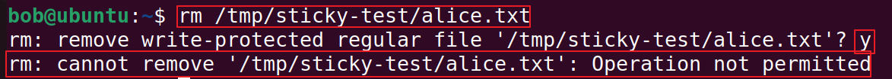
> _"Screenshot showing a failed attempt to delete a file from /tmp/sticky-test by a non-owner, illustrating the protection provided by the sticky bit."_

#### Command Explanations

- `su - alice` / `su - bob`: Switch users.
- `touch ...`: Create a test file.
- `rm ...`: Attempt to delete (should fail for non-owner when sticky bit is set).

---


---

## Summary Table

| Bit         | Octal  | Symbolic   | Typical Use Case                  |
|-------------|--------|------------|-----------------------------------|
| SetUID      | 4xxx   | u+s        | passwd, security tools            |
| SetGID      | 2xxx   | g+s        | group collaboration, shared dirs  |
| Sticky Bit  | 1xxx   | +t         | /tmp, shared workspaces           |

---

**For further reading:**  
- [man chmod](https://man7.org/linux/man-pages/man1/chmod.1.html)
- [man setuid](https://man7.org/linux/man-pages/man2/setuid.2.html)
- [Wikipedia: SetUID](https://en.wikipedia.org/wiki/Setuid)

---

## Troubleshooting

- **useradd: command not found**: Ensure you have sudo privileges and are on a supported Linux distro.
- **Permission denied**: Use `sudo` for admin commands.
- **User still appears after deletion**: Check for running processes (`ps -u [username]`) and use force only if necessary.
- **SGID not effective**: Confirm directory permissions (`ls -ld`), and that users are in the correct group.

---

## FAQ

**Q: What happens if I forget the SGID bit?**  
A: New files will default to the user's primary group, causing permission issues for collaboration.

**Q: How do I recover a deleted user?**  
A: You must recreate the user and reassign files manually; deletion is irreversible unless backups exist.

**Q: Can users see each other's files after deletion?**  
A: Files remain, but are owned by the former user's UID. Reassign group/user ownership as needed.

**Q: Is it safe to use `userdel -f`?**  
A: Only as a last resort. This can leave orphaned processes and files.

---

## Further Reading

- [Linux User Management - The Linux Documentation Project](https://tldp.org/LDP/GNU-Linux-Tools-Summary/html/x11755.htm)
- [Linux File Permissions and Ownership - Ubuntu Documentation](https://help.ubuntu.com/community/FilePermissions)
- [SGID Bit - Wikipedia](https://en.wikipedia.org/wiki/Setuid#setgid)
- `man useradd`, `man userdel`, `man chmod`, `man chgrp`

---

## Clean-Up

To reset this lab environment:

```bash
sudo userdel -r alice
sudo userdel -r bob
sudo groupdel webdev
sudo rm -rf /opt/project_alpha
```

---

## Credits

Lab design and documentation by [Christopher Aondoakaa](https://github.com/chrisaondo).  
Inspired by best practices from the Linux community and security professionals.

---